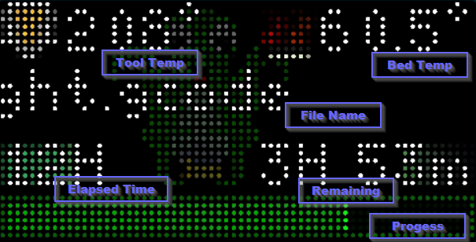

# octoprint-status

Displays the status of configured Octoprint server.

Grabs the status using OctoPrint's REST interface over HTTP. Displays the current hot end and bed temperatures, currently printing job, elapsed and remaining time, and a progress bar.

Needs an Application API Key from OctoPrint - create one for Tidbyt under User Settings in the OctoPrint WebUI.

## Screenshot

